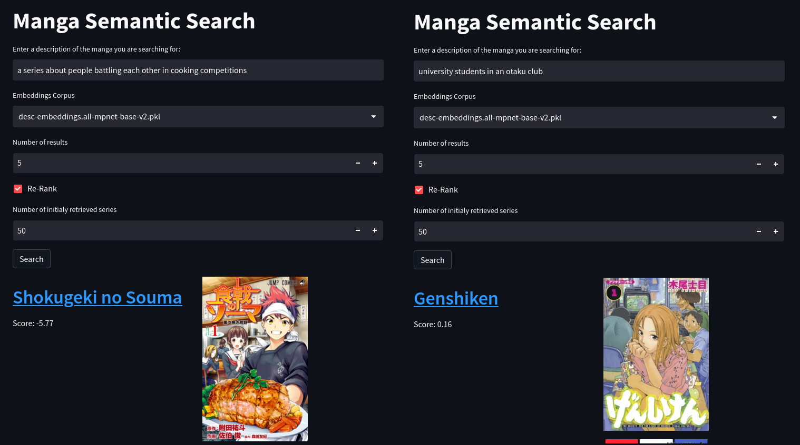

# Manga Semantic Search
An application to search for manga series using text descriptions of it's content. Find the name of a series based on a vague recollection about its story.

__Note__: The current database only includes the top 1000 manga series on AniList.

## Requirements
- Python 3.10+
- `pip install -r requirements`

## Usage
To start run `streamlit run app.py` which will open the application a browser new tab.

#### Data Preparation
To re-reproduce the search embedding corpus, do the following:

1. Run `python scrape.py -n 1000 -b 50 -w 0 -o raw.csv` to get the data for the top-1000 series from the AniList API in the file `raw.csv`. If you are being rate limited, adjust `-w` to change the number of seconds between requests.
2. Run `python clean-data.py -i raw.csv -o cleaned.csv` to clean the data into the correct input format.
3. Run `python build-corpus.py -i cleaned.csv -o desc-embeddings.pkl -m all-mpnet-base-v2` to create the embeddings corpus `desc-embeddings.pkl`.

